```mermaid
graph TD
  subgraph UI["📱 UI Layer"]
    UIZ1["UI.Z1 ZoneName"]
    UIZ2["UI.Z2 ZoneName"]
  end

  subgraph Glue["🔗 Glue Layer"]
    GZ1["G.Z1 ZoneName"]
  end

  subgraph Logic["💼 Logic Layer"]
    LZ1["L.Z1 ZoneName"]
  end

  subgraph Data["💾 Data Layer"]
    DZ1["D.Z1 ZoneName"]
  end

  %% Compliant dependencies: solid arrows
  UIZ1 --> GZ1
  GZ1 --> LZ1
  LZ1 --> DZ1

  %% Violations: dashed arrows with labels
  UIZ2 -.->|"🟢 skip layer"| LZ1
```

```mermaid
graph LR
  subgraph DIR["📁 Physical Directories"]
    D1["services/"]
    D2["pages/schedule/"]
    D3["pages/account/"]
  end

  subgraph ZONE["🧩 Logical Zones"]
    Z1["L.Z4 AccountZone"]
    Z2["UI.Z4 ScheduleUIZone"]
    Z3["UI.Z6 AccountUIZone"]
  end

  D1 --> Z1
  D2 --> Z2
  D3 --> Z3

  %% Misplaced files: dashed red lines
  D1 -.->|"⚠️ OAuthPopup<br/>UI component in services/"| Z3
```

# CLVZ — Zone & Layer-Zone Tree: An AI Playbook

> **This is an instruction manual for AI assistants. It works with any language and any platform.**
>
> After reading this, you'll know what a Zone is, what a Layer-Zone Tree is, how to generate one, and how to handle edge cases.
>
> This is the universal edition — refined from real-world AI-driven analysis on production codebases, with multi-language examples.

---

## 0. What Layers and Zones Actually Are

**Both Layers and Zones are logical concepts, not folders.**

Both are inferred by the AI after reading the actual source code:

- **Layer** (technical responsibility): The AI reads file contents and determines whether the code handles UI rendering, business logic, or data storage — then assigns the file to the appropriate Layer. Even if a file physically lives in a `logic/` directory, if its code is a UI component, the AI should classify it as UI Layer.
- **Zone** (functional responsibility): Within each Layer, the AI groups files by asking "what problem do these files solve together?" and infers a Zone name from the answer. Zone names don't come from folder names or file names — they come from what the code actually does.

**In one sentence**: Layers and Zones are both logical labels inferred by the AI from actual code behavior. Layers slice vertically by technical role; Zones slice horizontally by feature within a Layer. Neither equals a physical directory.

> **Git analogy**: A git branch is a logical label pointing to a chain of commits — it doesn't correspond to a folder on disk. Zones work the same way: they're logical labels marking "these files solve this problem together," independent of where the files physically sit.
>
> - Git branches can be created, merged, and deleted without moving files → Zones can be defined, merged, and renamed without touching code files
> - Git branches let you manage changes through a logical lens → Zones let you understand structure through a logical lens
> - Git separates physical storage (.git/objects) from logical concepts (branch/tag) → CLVZ separates logical Zones from physical directories

**Core distinction**:

```
Logical Zone = The default. The core concept. No files are moved — Zones exist only in the Tree document.
Physical Zone = Optional advanced step. Materializing logical Zones into actual folder structures (see §5).
```

All rules and workflows in this document assume logical Zones unless stated otherwise.

---

## 1. Core Concepts

### 1.1 Layer

A Layer is a vertical slice of the codebase grouped by technical responsibility.

**The Base Three**:

| Layer | Responsibility | Typical Contents |
|:------|:---------------|:-----------------|
| UI | User interface and interaction | Views, pages, components, layouts |
| Logic | Business logic and state management | Services, managers, business rules, state machines |
| Data | Data storage and access | Persistence, network requests, caching, data transformation |

**Common Extensions** (add based on actual project structure):

| Extension Layer | When Needed | Typical Contents |
|:----------------|:------------|:-----------------|
| Core | Project has a standalone bootstrap / DI container | App entry point, DI container, startup config |
| Glue | A distinct middle layer sits between UI and Logic | ViewModel, Coordinator, Presenter |
| Models | Many value types are shared across layers | Domain models, DTOs, enum definitions |

**Signals for a Glue Layer by platform**:

| Platform | Signal That a Glue Layer Exists |
|:---------|:--------------------------------|
| iOS/macOS | Dedicated `ViewModels/` directory with 5+ files |
| Android | ViewModel layer (Jetpack ViewModel / MVI) |
| Web/React | Dedicated hooks/ or stores/ directory |
| Web/Vue | Dedicated composables/ or stores/ directory |
| Flutter | Dedicated Bloc / Provider / Riverpod layer |
| Backend | Dedicated Controller/Handler layer bridging routes and services |

**Key point**: The number of Layers is not fixed. Start with the base three and adjust based on what the project actually looks like.

**Dependency direction**: Strictly downward.

```
Core → UI → Glue → Logic → Data
                            ↑
                     Models (referenced by all layers, depends on none)
```

### 1.2 Zone

A Zone is a logical partition within a Layer, grouping files by functional responsibility.

**Plain English**: A single Layer may contain many files. A Zone groups together the files that "serve the same feature."

**Remember**: Zone names come from the AI's analysis of code behavior, not from folder or file names. A folder called `utils/` might contain files belonging to 3 different Zones; a Zone called `ScheduleZone` might have files scattered across 2 different directories.

**Full Zone descriptor**:

| Field | Meaning | Example |
|:------|:--------|:--------|
| name | Business name (AI-inferred) | TaskZone |
| layer | Parent Layer | Logic |
| type | Role type | execution or organization |
| responsibility | One-line summary | "Task creation, management, and state transitions" |
| files | List of source files | [TaskManager, TaskValidator] |
| dependencies | Other Zones this one depends on | [D.Z1 PersistenceZone] |
| children | Child Zones (organization type only) | [TaskZone, TimerZone] |

### 1.3 Two Roles a Zone Can Play

**Execution Zone**:
- Contains concrete business logic
- Does the work itself
- Examples: TaskZone, TimerZone, PersistenceZone

**Organization Zone**:
- Contains no business logic — just coordinates other Zones
- Delegates work to others
- Examples: BootstrapZone (assembles DI), MainWindowZone (coordinates page modules)

**Decision rule**: If a Zone has concrete business implementations → execution. If it only calls/coordinates other Zones → organization.

### 1.4 Non-Zone Code

Not every file in a Layer needs to belong to a Zone. But "non-Zone" isn't a junk drawer — it requires judgment:

**Belongs in non-Zone**:
- Pure utility functions (string manipulation, formatting)
- Constant definitions (color palettes, dimension constants, config values)
- Language extensions / helper classes (date formatters, type conversions)
- Stateless helpers

**Should be its own Zone** (checklist):

```
Should this be a Zone?
  □ Has independent business responsibility? (not just a utility)
  □ Manages its own state? (reactive state / persistence / singleton state)
  □ Other Zones depend on it?
  □ Will evolve independently? (likely to grow in complexity)

≥2 checks → Create a Zone
<2 checks → Mark as non-Zone code
```

**Why these four criteria**:

| Criterion | Dimension | Rationale |
|-----------|-----------|-----------|
| Independent business responsibility | Business boundary | Filters out pure utility code. A Zone should represent a business domain (e.g., "Authentication", "Payments"), not a technical helper (e.g., `StringUtils`) |
| Manages its own state | State boundary | State = its own lifecycle. Code that manages persistence, reactive state, or singletons is not a passive utility — it has independent significance |
| Other Zones depend on it | Dependency boundary | If multiple Zones depend on this code, changes to it create ripple effects. It needs to be tracked and managed as an independent Zone |
| Will evolve independently | Evolution boundary | A forward-looking judgment. Even if the code is small today, if it will likely grow in complexity on its own, creating a Zone early is easier than splitting an overgrown module later |

**Why the threshold is ≥2**: Meeting only 1 criterion is usually insufficient (e.g., a pure utility function depended on by many Zones still isn't a Zone). Meeting 2 criteria provides cross-validation from multiple dimensions. The threshold is 2 rather than 3 because **merging two Zones is far easier than splitting one bloated Zone** — when in doubt, create the Zone.

**Rule**: Every file must either belong to a Zone or be explicitly marked as non-Zone. No file left unaccounted for.

### 1.5 Layer-Zone Tree

A Layer-Zone Tree is a complete structural description of a project's Layer hierarchy and Zone partitions.

It answers six questions:
1. How many Layers does the project have?
2. What Zones exist in each Layer?
3. What is each Zone responsible for?
4. Which files belong to each Zone?
5. What are the dependency relationships between Zones?
6. Are there files that don't belong to any Zone?

---

## 2. Rules

### 2.1 Zone Assignment Rules

```
Rule 1: One file belongs to one Zone
  If a file seems to belong to two Zones → mark it as "assignment pending" and list it separately.
  Format: filename → Candidate Zone1 / Candidate Zone2 + reason.
  Don't force it into one Zone — leave the decision to the developer.

Rule 2: Zones are defined by functional responsibility, not file count
  A single file can be its own Zone (if its responsibility is independent and important).
  A Zone with 15+ files — consider splitting into Sub-Zones.
  If two Zones always change together and share the same dependents, consider merging.

Rule 3: A Zone cannot span multiple Layers
  All files in a Zone must belong to the same Layer.
  TaskManager (Logic) and TaskView (UI) cannot be in the same Zone.

Rule 4: Zone nesting must not exceed 3 levels
  Layer → Zone → Sub-Zone → Mini-Zone (3 levels max)
  Exceeding 3 levels indicates over-engineering.
```

### 2.2 Cross-Layer Naming Convention

A single feature (e.g., Schedule) typically spans multiple Layers, with one Zone in each. Naming convention:

```
Data Layer:   [Feature]DataZone      (e.g., ScheduleDataZone)
Logic Layer:  [Feature]Zone          (e.g., ScheduleZone) — the primary Zone, no suffix
Glue Layer:   [Feature]GlueZone     (e.g., ScheduleGlueZone)
UI Layer:     [Feature]UIZone       (e.g., ScheduleUIZone)
```

This way, a Zone name instantly tells you which Layer it's in and which feature it serves.

### 2.3 Dependency Rules

```
Rule 1: Cross-layer dependencies must point strictly downward
  ✅ UI → Glue → Logic → Data (layer by layer)
  ❌ Logic → UI (reverse dependency)
  ❌ UI → Data (skipping Glue and Logic)

Rule 2: Zones within the same Layer may depend on each other
  ✅ PaymentZone depends on AccountZone (both in Logic Layer)
  But should go through interfaces/protocols, not direct internal references.

Rule 3: Organization Zones coordinate their child Zones
  BootstrapZone may call TaskZone and TimerZone.
  TaskZone and TimerZone must not depend back on BootstrapZone.

Rule 4: Models Layer is referenced by all layers but depends on none
  Models are pure value types with no imports of business code.
```

### 2.4 Dependency Violation Severity

When a violation is found, classify it:

```
🟢 Acceptable
  Scenario: Skipping one layer in a simple case where adding the intermediate layer would be over-engineering.
  Example: SettingsView reads SettingsManager directly — no ViewModel needed.
  Action: Flag it, but don't require a fix.

🟡 Watch
  Scenario: Skipping two layers. Currently manageable, but will cause problems if logic grows.
  Example: ViewModel directly depends on a Data layer Store, bypassing Logic.
  Action: Flag it. Recommend adding the intermediate layer during the next refactor.

🔴 Must Fix
  Scenario: Reverse dependency or circular dependency.
  Example: Logic layer imports a UI View; two Zones depend on each other.
  Action: Flag as a blocking issue with a fix recommendation.
```

---

## 3. How to Generate a Layer-Zone Tree

### 3.1 Bottom-up: From Existing Code

**Scenario**: The project already has code. Generate a Layer-Zone Tree to understand its structure.

**Step 1: Scan the project and list all source files**

Output a complete file inventory (name + path), grouped by directory.

**Step 2: Determine the Layer structure**

Look at the project's directory layout and decide how many Layers are needed:
- Has a ViewModel / hooks / composables directory with 5+ files → add Glue Layer
- Has a standalone bootstrap / DI container directory → add Core Layer
- Has a Models directory with models referenced across layers → add Models Layer

**Step 3: Assign each file to a Layer**

Based on file contents (not folder location):

```
• Views / pages / components / layout code        → UI Layer
• Services / managers / business rules / state     → Logic Layer
• Persistence / ORM / caching / external API calls → Data Layer
• ViewModel / Coordinator / Presenter              → Glue Layer
• Pure data models / DTOs / enum definitions       → Models Layer
• App entry point / DI container / bootstrap        → Core Layer
```

**Layer classification by language/framework**:

| Language/Framework | UI Layer | Logic Layer | Data Layer |
|:-------------------|:---------|:------------|:-----------|
| Swift (AppKit/UIKit) | NSView, UIView, ViewController | Manager, Service | CoreData, Keychain, URLSession |
| Swift (SwiftUI) | View struct, ViewModifier | ObservableObject (business) | Same as above |
| Kotlin (Android) | Activity, Fragment, Composable | ViewModel (business), UseCase | Room, Retrofit, DataStore |
| React (TS/JS) | Component (.tsx), Page | Hook (business), Service | API client, localStorage |
| Vue | .vue SFC, Component | Composable, Store (Pinia) | API module, IndexedDB |
| Flutter (Dart) | Widget, Page | Bloc, Provider, Cubit | Repository, Dio client |
| Go (backend) | Handler, Middleware | Service, Domain | Repository, DB client |
| Python (Django) | Template, Serializer | Service, Domain | Model (ORM), Repository |
| Python (FastAPI) | Router, Schema | Service, Domain | CRUD, DB session |
| Rust (backend) | Handler, Route | Service, Domain | Repository, DB pool |

**Important**: A file's physical location may not match its logical Layer. For example, a UI component sitting in a `services/` directory — always classify by content, and flag the mismatch.

**Step 4: Within each Layer, group files into Zones by functional responsibility**

Ask yourself: what problem do these files solve together? The answer is the Zone's responsibility description.

Group by actual function, not by filename prefix or folder location.

**Step 5: Fill in complete info for each Zone**

name, layer, type, responsibility, files, dependencies

**Step 6: Mark non-Zone code**

Files that don't belong to any Zone go into the "non-Zone code" list for their respective Layer.
Use the §1.4 checklist to confirm they truly don't need a Zone.

**Step 7: Analyze dependencies**

Detection methods (strongest to weakest):

```
1. Constructor injection / parameter passing → Strong dependency (most explicit)
2. Global singleton / static access          → Implicit dependency (easy to miss)
3. Interface / protocol implementation       → Interface dependency
4. Reactive subscription / event listener    → Data flow dependency
5. Callback / notification / event bus       → Loose coupling dependency
```

**Implicit dependency signals by language**:

| Language | Implicit Dependency Signal |
|:---------|:--------------------------|
| Swift | `.shared` singleton access |
| Kotlin | `object` singleton, Hilt `@Inject` |
| JS/TS | Top-level module `import`, global store access |
| Python | Module-level `import`, Django `settings` |
| Go | Global `var`, `init()` function |
| Rust | `lazy_static!`, `once_cell` |

Pay special attention: **Global singletons hide dependency relationships.** If a file accesses global state, it depends on the corresponding Zone — even without constructor injection. Scan for global access patterns in every file body.

Validate each dependency against §2.3. Flag violations with severity levels from §2.4.

**Step 8: Output the Layer-Zone Tree**

Use the output format from §4. Default to the compact version; output the full version when the developer requests it.

### 3.2 Top-down: From Requirements

**Scenario**: New project or new feature. Design the Layer-Zone Tree before writing code.

```
Step 1: Define the project's core features
  List what needs to be built. E.g.: task management, timer, notifications, data storage.

Step 2: Determine the Layer structure
  Start with the base three, extend as needed (see §1.1).

Step 3: Map each feature to an initial Zone
  Each core feature = one execution Zone.
  Use the naming convention from §2.2.

Step 4: Decide if organization Zones are needed
  Complex interactions between multiple Zones → add an organization Zone to coordinate.

Step 5: Define each Zone's responsibility
  One sentence describing what it owns.

Step 6: Plan dependency relationships
  Validate against the dependency rules.

Step 7: Output the Layer-Zone Tree
```

### 3.3 Calibration: Design vs. Reality

**Scenario**: You designed a top-down Tree, then built the code. Now you need to check for drift.

```
Step 1: Generate a current Layer-Zone Tree from actual code using §3.1
Step 2: Diff it against the designed Layer-Zone Tree, item by item
Step 3: Output a drift report:
  • Zones in the design but missing from the code
  • Zones in the code but not in the design
  • Files assigned differently than designed
  • Dependency relationships that don't match the design
  • Physical directory structure that diverges from logical Zones
```

---

## 4. Output Format

After analysis, the AI should produce **two separate files**:

```
[ProjectName]_Layer-Zone_Tree.md      — Structured text (format defined in §4 below)
[ProjectName]_Layer-Zone_Visuals.md   — Mermaid visualizations (format defined in §6)
Both files in the same directory.
```

**How the two files relate**: The Tree is the data source; the Visuals are visual representations derived from Tree data.

| Tree Section | Content | → | Corresponding Visuals |
|:-------------|:--------|:-:|:----------------------|
| 4.1 Structure Overview | Layers, Zones, file assignments | → | Diagram 1 Layer Overview, Diagram 4 File Distribution Pie, Diagram 7 Zone Size Ranking |
| 4.2 Zone Detail Table | Zone IDs, responsibilities, dependencies | → | Diagram 2 Zone Dependency Graph, Diagram 5 Intra-Layer Dependency |
| 4.3 Dependency Compliance | Violations and severity levels | → | Diagram 6 Violation Highlight |
| 4.1 + 4.2 (grouped by feature) | Feature chains (UI→Glue→Logic→Data) | → | Diagram 3 Feature Slice View |
| 4.7 Physical/Logical Mismatch | Directory-to-Zone mapping mismatches | → | Diagram 8 Physical ↔ Logical Mapping |

**Why two files**: The Tree is structured data (tables, tree diagrams) for humans and AI to read and query. The Visuals file is for rendering in tools like Obsidian, GitHub, and VS Code. Mixing them makes the main file too long and clutters text reading with Mermaid code blocks.

### 4.0 Output Tiers

```
Compact (default): 4.1 Structure Overview + 4.3 Dependency Compliance + 4.4 Summary Stats
Full (on request):  All of 4.1 ~ 4.6
```

Compact is for a quick overview. Full is for file-by-file auditing.

```
≤50 files   → Output full version directly (4.1 ~ 4.6)
50~200 files → Output 4.1 + 4.2 + 4.3 + 4.4 + 4.5, skip 4.6 full table
>200 files   → Output compact (4.1 + 4.3 + 4.4), add other sections on request
```

### 4.1 Structure Overview (Tree Diagram)

**File header** (required at the top of the Tree file):

```
# [ProjectName] — Layer-Zone Tree

> Generated via [Bottom-up / Top-down] analysis (CLVZ §3.x) | ~N files | YYYY-MM-DD
```

**Tree diagram**:

```
[ProjectName] — Layer-Zone Tree

🚀 Core Layer
│
├─ [ZoneName] [organization]  — Core.Z1
│  "[one-line responsibility]"
│  Contains: [file1, file2, ...]
│  Coordinates: [ZoneName, ...]
│
└─ Non-Zone code: [file1, ...]

📱 UI Layer
│
├─ [ZoneName] [organization]  — UI.Z1
│  "[one-line responsibility]"
│  Contains: [file1, ...]
│  Coordinates: [UI.Z2, UI.Z3, ...]
│
├─ [ZoneName] [execution]  — UI.Z2
│  "[one-line responsibility]"
│  Contains: [file1, file2, ...]
│  Depends on: [G.Z1 ZoneName]
│
└─ Non-Zone code: [file1, ...]

🔗 Glue Layer
│
├─ [ZoneName] [execution]  — G.Z1
│  "[one-line responsibility]"
│  Contains: [file1, ...]
│  Depends on: [L.Z1 ZoneName, L.Z2 ZoneName]
│
└─ Non-Zone code: [file1, ...]

💼 Logic Layer
│
├─ [ZoneName] [execution]  — L.Z1
│  "[one-line responsibility]"
│  Contains: [file1, file2, ...]
│  Depends on: [D.Z1 ZoneName]
│
└─ Non-Zone code: [file1, ...]

💾 Data Layer
│
├─ [ZoneName] [execution]  — D.Z1
│  "[one-line responsibility]"
│  Contains: [file1, ...]
│  Depends on: (none)
│
└─ Non-Zone code: [file1, ...]

📦 Models (shared across layers)
│
└─ Non-Zone code: [grouped by domain]
```

**ID scheme**:

| Layer | Prefix | Examples |
|:------|:-------|:---------|
| Core | Core.Z | Core.Z1 |
| UI | UI.Z | UI.Z1, UI.Z2 |
| Glue | G.Z | G.Z1, G.Z2 |
| Logic | L.Z | L.Z1, L.Z2 |
| Data | D.Z | D.Z1, D.Z2 |

### 4.2 Zone Detail Table

| ID | Zone | Layer | Type | Responsibility | Files | Dependencies |
|:---|:-----|:------|:-----|:---------------|:------|:-------------|
| UI.Z1 | MainWindowZone | UI | organization | Main window module coordination | 1 | Coordinates UI.Z2~Z5 |
| L.Z1 | TaskZone | Logic | execution | Task creation, management, state transitions | 2 | D.Z1 |
| D.Z1 | PersistenceZone | Data | execution | Data persistence and access | 2 | (none) |

### 4.3 Dependency Compliance Table

List all dependency relationships. Splitting compliant and non-compliant dependencies into two sub-tables is recommended, with violations accompanied by explanations.
Organization Zone "coordination" relationships are not listed in this table — they appear only in 4.1 Structure Overview and the Visuals dependency diagrams.

| Source Zone | Target Zone | Direction | Severity |
|:------------|:------------|:----------|:---------|
| UI.Z2 → G.Z1 | SidebarZone → TaskGlueZone | UI → Glue | ✅ |
| L.Z1 → D.Z1 | TaskZone → PersistenceZone | Logic → Data | ✅ |
| **UI.Z7 → L.Z7** | **SettingsUIZone → SettingsZone** | **UI → Logic** | **🟢 Acceptable** |
| **G.Z3 → D.Z3** | **AIGlueZone → AIDataZone** | **Glue → Data** | **🟡 Watch** |

### 4.4 Summary Stats

```
Layers: X
Total Zones: X (execution X + organization X)
Total Files: X
  In Zones: X
  Non-Zone: X
  Models (shared): X
  Assignment pending: X
Dependencies: X (✅ compliant X / 🟢 acceptable X / 🟡 watch X / 🔴 must fix X)
```

### 4.5 Pending Assignment Table (full version)

| File | Candidate A | Candidate B | Reason |
|:-----|:------------|:------------|:-------|
| EventRouter | L.Z1 CoreZone | L.Z2 TaskZone | Handles both global routing and task state notifications |

> Lists files that can't be clearly assigned to a single Zone. Left to the developer's judgment.

### 4.6 File Attribution Table (full version)

| File | Zone | Layer |
|:-----|:-----|:------|
| TaskManager | L.Z1 TaskZone | Logic |
| Utilities | (non-Zone) | Logic |

### 4.7 Physical vs. Logical Mismatch Table

List cases where a file's physical directory doesn't match its logical Zone assignment (see §5 for context).

| Physical Location | File | Logical Zone | Mismatch |
|:------------------|:-----|:-------------|:---------|
| logic/ | ThemeManager | UI-related logic | Physically in logic/ but logically belongs to UI Layer |

> If there are no mismatches, this table can be omitted with a note: "No physical/logical mismatches found."

### 4.8 Analysis Summary

The Tree file should end with a brief analysis summary (10~20 lines max) covering:

```
- Overall architecture assessment (1~2 sentences)
- Specific remediation advice for violations
- Key physical/logical mismatches
- Zones worth attention (too large — consider splitting / too small — consider merging)
```

---

## 5. Logical Zones vs. Physical Directories

Zones are logical. Directories are physical. Their relationship:

```
Ideal case: one Zone ≈ one directory
  Example: files under src/schedule/ = UI.Z4 ScheduleUIZone

Common mismatches:
  • One directory contains files from multiple Zones
  • One Zone's files are scattered across multiple directories
  • A file's physical location contradicts its logical Layer (e.g., UI component in services/)

One of the key values of a Layer-Zone Tree is exposing these logical vs. physical mismatches.
```

### 5.1 Physical Zones (Optional Advanced)

When a project matures and you want to materialize logical Zones into actual folder structures, use Physical Zones:

```
Physical Zone = Zone Facade + Workers

Zone Facade (z_ prefixed files — the Zone's public interface):
  z_[ZoneName]Protocol   — Interface definition (required)
  z_[ZoneName]           — Coordinator (optional)
  z_[ZoneName]DTO        — Data types (as needed)
  z_[ZoneName]Tests      — Tests (recommended)

Workers (normally named files — the Zone's internal implementation):
  [Name]Manager
  [Name]Service
  etc.
```

The z_ prefix distinguishes "Zone facade files" from "implementation worker files."

**Note**: Not every Zone needs to be materialized. Logical Zones are sufficient in most cases. Whether to materialize is the developer's call.

---

## 6. Visualization (Mermaid)

This section defines the content format for `[ProjectName]_Layer-Zone_Visuals.md` (file naming and correspondence — see the introduction of §4).

**File header** (required at the top of the Visuals file):

```
# [ProjectName] — Layer-Zone Visuals

> Companion to [ProjectName]_Layer-Zone_Tree.md | YYYY-MM-DD
```

The Visuals file uses `## N. [Diagram Title]` headings (N = 1~8), with `---` separators between diagrams.

Mermaid renders natively in Obsidian, GitHub, VS Code, Notion, and many other tools.

### 6.1 Required Diagrams

The visuals file should contain all of the following:

| # | Diagram | Mermaid Type | Purpose |
|:--|:--------|:-------------|:--------|
| 1 | Layer Overview | `block-beta` or `graph TD` | All Layers and their Zones at a glance |
| 2 | Zone Dependency Graph | `graph TD` + subgraph | All inter-Zone dependencies; solid lines for compliant, dashed for violations |
| 3 | Feature Slice View | `graph LR` | Pick 3~6 core features. Show how each flows from UI through to Data (one horizontal line per feature). Prioritize features that span all layers; if a feature doesn't span all layers (e.g., Settings has no Data layer), note the missing layer |
| 4 | File Distribution Pie | `pie` | Two pies: by Layer + within the largest Layer by Zone |
| 5 | Intra-Layer Dependency | `graph TD` | One diagram per Layer with ≥5 Zones. Shows dependencies between Zones within that Layer. Zones depended on by ≥2 peers are marked as hubs (bold border) |
| 6 | Violation Highlight | `graph TD` | All violations isolated, with reasons and severity |
| 7 | Zone Size Ranking | `xychart-beta horizontal` | Horizontal bar chart (use `horizontal` to prevent label overlap). All Zones sorted by file count. If >20 Zones, show only the top 20 and note "Top 20 of N Zones" in the title |
| 8 | Physical ↔ Logical Mapping | `graph LR` | Physical directories on the left, logical Zones on the right, lines showing mapping, mismatches highlighted |

Generate all 8 diagrams. Do not skip any. Below each diagram, add 1~3 lines of commentary (using `>` blockquote format) highlighting key findings.

### 6.2 Mermaid Templates

**Zone Dependency Graph** (the most important one):

````

````

**Feature Slice View**:

````

````

**File Distribution Pie**:

````

````

**Zone Size Ranking**:

````

````

> All Zones sorted by file count, descending. Zones with 15+ files are split candidates; 1-file Zones should be checked for possible merging.

**Physical ↔ Logical Zone Mapping**:

````

````

> Focus on misplaced files (physical location doesn't match logical assignment). Normal mappings can be abbreviated or omitted.

### 6.3 Mermaid Conventions

```
Naming:
  Node IDs use Zone ID abbreviations: UIZ1, GZ1, LZ1, DZ1
  Node labels show: ID + Zone name (e.g., "L.Z1 TaskZone")
  Use <br/> for line breaks within labels

Lines:
  Compliant dependency: solid arrow -->
  Violation: dashed arrow -.-> with label |"🟢/🟡/🔴 description"|
  Organization coordination: dashed -.->

Grouping:
  Each Layer wrapped in a subgraph
  Subgraph titles include emoji: 📱 UI / 🔗 Glue / 💼 Logic / 💾 Data

Styling (optional):
  Hub Zones (depended on by many) get bold borders
  Violating Zones use classDef with orange dashed borders
```

---

## 7. Quick Reference Card

```
Zone = A logical partition within a Layer, grouped by functional responsibility
Zone name = Inferred by AI from code behavior, not from folder or file names
Layer-Zone Tree = The complete Layer + Zone hierarchy of a project

Two Zone roles: execution (does the work) / organization (coordinates)
Two Zone forms: logical (default, no files moved) / physical (optional, creates folders + z_ prefix)

Three ways to build a Layer-Zone Tree:
  Bottom-up:   Scan code → infer Zones → output Tree
  Top-down:    Analyze requirements → design Zones → output Tree
  Calibration: Design Tree vs. actual Tree → drift report

Layer hierarchy (choose based on project):
  Base:     UI → Logic → Data
  Extended: Core → UI → Glue → Logic → Data + Models

ID scheme: Core.Z1, UI.Z1, G.Z1, L.Z1, D.Z1

Cross-layer naming for the same feature:
  Data:  [Feature]DataZone
  Logic: [Feature]Zone
  Glue:  [Feature]GlueZone
  UI:    [Feature]UIZone

One file belongs to exactly one Zone.
Dependencies flow strictly downward. Violations graded: 🟢 acceptable / 🟡 watch / 🔴 must fix.
Every file is either in a Zone or explicitly marked as non-Zone. No file left behind.
Works with any language and any platform.
```

---

## Appendix A: Full TodoApp_Layer-Zone_Tree.md Example

> Below is a complete Layer-Zone Tree for a fictional React + TypeScript project called "TodoApp" (roughly 25 files).
> It demonstrates every section defined in S4.

---

### Example File: `TodoApp_Layer-Zone_Tree.md`

```markdown
# TodoApp — Layer-Zone Tree

> Generated via Bottom-up analysis (CLVZ S3.1) | ~25 files | 2026-02-01

---

## 4.1 Structure Overview

TodoApp — Layer-Zone Tree

📱 UI Layer
│
├─ AppShellZone [organization]  — UI.Z1
│  "Top-level UI shell — coordinates routing and page layout"
│  Contains: App.tsx, Layout.tsx
│  Coordinates: UI.Z2 TaskUIZone, UI.Z3 AuthUIZone, UI.Z4 SettingsUIZone
│
├─ TaskUIZone [execution]  — UI.Z2
│  "Task list display, creation form, task detail page"
│  Contains: TaskList.tsx, TaskItem.tsx, TaskForm.tsx, TaskDetail.tsx, TaskFilter.tsx
│  Depends on: G.Z1 TaskGlueZone
│
├─ AuthUIZone [execution]  — UI.Z3
│  "Login, registration pages and authentication status display"
│  Contains: LoginPage.tsx, RegisterPage.tsx, AuthStatus.tsx
│  Depends on: G.Z2 AuthGlueZone
│
└─ SettingsUIZone [execution]  — UI.Z4
   "User settings page and preference configuration"
   Contains: SettingsPage.tsx, ThemeToggle.tsx
   Depends on: L.Z3 SettingsZone 🟢

🔗 Glue Layer
│
├─ TaskGlueZone [execution]  — G.Z1
│  "Bridges task UI and business logic; manages task state and side effects"
│  Contains: useTaskStore.ts, useTaskActions.ts
│  Depends on: L.Z1 TaskZone, L.Z2 AuthZone
│
└─ AuthGlueZone [execution]  — G.Z2
   "Bridges auth UI and business logic; manages login state"
   Contains: useAuthStore.ts
   Depends on: L.Z2 AuthZone, D.Z2 APIClientZone 🟡

💼 Logic Layer
│
├─ TaskZone [execution]  — L.Z1
│  "Task CRUD logic, filtering, sorting, and completion state management"
│  Contains: TaskService.ts, TaskValidator.ts, TaskSorter.ts
│  Depends on: D.Z1 PersistenceZone, D.Z2 APIClientZone
│
├─ AuthZone [execution]  — L.Z2
│  "User authentication, token management, and session expiry handling"
│  Contains: AuthService.ts, TokenManager.ts
│  Depends on: D.Z2 APIClientZone
│
├─ SettingsZone [execution]  — L.Z3
│  "User preference read/write (theme, language, notification toggles)"
│  Contains: SettingsService.ts
│  Depends on: (localStorage — no Data Zone dependency)
│
└─ Non-Zone code: utils.ts

💾 Data Layer
│
├─ PersistenceZone [execution]  — D.Z1
│  "IndexedDB local persistence and offline cache management"
│  Contains: db.ts, TaskRepository.ts
│  Depends on: (none)
│
└─ APIClientZone [execution]  — D.Z2
   "HTTP client wrapper, request interception, and unified error handling"
   Contains: apiClient.ts
   Depends on: (none)

📦 Models (shared across layers)
│
├─ Task domain
│  └─ Task.ts
├─ User domain
│  └─ User.ts
├─ Settings domain
│  └─ Settings.ts
└─ API domain
   └─ APIResponse.ts


## 4.2 Zone Detail Table

| ID | Zone | Layer | Type | Responsibility | Files | Dependencies |
|:---|:-----|:------|:-----|:---------------|:------|:-------------|
| UI.Z1 | AppShellZone | UI | organization | Top-level UI shell; coordinates routing and page layout | 2 | Coordinates UI.Z2~Z4 |
| UI.Z2 | TaskUIZone | UI | execution | Task list display, creation form, task detail page | 5 | G.Z1 |
| UI.Z3 | AuthUIZone | UI | execution | Login, registration pages and auth status display | 3 | G.Z2 |
| UI.Z4 | SettingsUIZone | UI | execution | User settings page and preference configuration | 2 | L.Z3 🟢 |
| G.Z1 | TaskGlueZone | Glue | execution | Bridges task UI and business logic | 2 | L.Z1, L.Z2 |
| G.Z2 | AuthGlueZone | Glue | execution | Bridges auth UI and business logic | 1 | L.Z2, D.Z2 🟡 |
| L.Z1 | TaskZone | Logic | execution | Task CRUD, filtering, sorting, completion state | 3 | D.Z1, D.Z2 |
| L.Z2 | AuthZone | Logic | execution | User authentication and token management | 2 | D.Z2 |
| L.Z3 | SettingsZone | Logic | execution | User preference read/write | 1 | (no Zone dependency) |
| D.Z1 | PersistenceZone | Data | execution | IndexedDB local persistence | 2 | (none) |
| D.Z2 | APIClientZone | Data | execution | HTTP client wrapper | 1 | (none) |


## 4.3 Dependency Compliance Table

**Compliant Dependencies**

| Source Zone | Target Zone | Direction | Status |
|:------------|:------------|:----------|:-------|
| UI.Z2 → G.Z1 | TaskUIZone → TaskGlueZone | UI → Glue | ✅ |
| UI.Z3 → G.Z2 | AuthUIZone → AuthGlueZone | UI → Glue | ✅ |
| G.Z1 → L.Z1 | TaskGlueZone → TaskZone | Glue → Logic | ✅ |
| G.Z1 → L.Z2 | TaskGlueZone → AuthZone | Glue → Logic | ✅ |
| G.Z2 → L.Z2 | AuthGlueZone → AuthZone | Glue → Logic | ✅ |
| L.Z1 → D.Z1 | TaskZone → PersistenceZone | Logic → Data | ✅ |
| L.Z1 → D.Z2 | TaskZone → APIClientZone | Logic → Data | ✅ |
| L.Z2 → D.Z2 | AuthZone → APIClientZone | Logic → Data | ✅ |

**Violations**

| Source Zone | Target Zone | Direction | Severity | Explanation |
|:------------|:------------|:----------|:---------|:------------|
| UI.Z4 → L.Z3 | SettingsUIZone → SettingsZone | UI → Logic (skips Glue) | 🟢 Acceptable | Settings is simple preference read/write with no state management to speak of. Adding a Glue layer would be over-engineering. If Settings later gains cloud-sync or complex validation, introduce G.Z3 SettingsGlueZone at that point |
| G.Z2 → D.Z2 | AuthGlueZone → APIClientZone | Glue → Data (skips Logic) | 🟡 Watch | useAuthStore directly calls apiClient for token refresh. This logic should live in L.Z2 AuthZone; the Glue layer should only invoke Logic interfaces |


## 4.4 Summary Stats

Layers: 4 (UI, Glue, Logic, Data)
Total Zones: 11 (execution 10 + organization 1)
Total Files: 25
  In Zones: 22
  Non-Zone: 1 (utils.ts)
  Models (shared): 4 (Task.ts, User.ts, Settings.ts, APIResponse.ts)
  Assignment pending: 1 (NotificationHelper.ts)
Dependencies: 10 (✅ compliant 8 / 🟢 acceptable 1 / 🟡 watch 1 / 🔴 must fix 0)


## 4.5 Pending Assignment Table

| File | Candidate A | Candidate B | Reason |
|:-----|:------------|:------------|:-------|
| NotificationHelper.ts | L.Z1 TaskZone | New L.Z4 NotificationZone | Handles both task-due notifications and system-level notification permission requests. Placing it in TaskZone introduces system API coupling; creating a standalone Zone leaves it at just 1 file |


## 4.7 Physical vs. Logical Mismatch Table

| Physical Location | File | Logical Zone | Mismatch |
|:------------------|:-----|:-------------|:---------|
| src/components/AuthModal.tsx | AuthModal.tsx | UI.Z3 AuthUIZone | Physically located in the generic components/ directory, but logically belongs to AuthUI. Consider moving to src/pages/auth/ or annotating the Zone assignment in the Tree |
| src/hooks/useSettings.ts | useSettings.ts | L.Z3 SettingsZone | Physically in hooks/ (typically Glue), but the actual code is pure logic — direct localStorage read/write with no React state management. Belongs in Logic Layer |


## 4.8 Analysis Summary

Overall architecture assessment:
  TodoApp uses a clean 4-layer architecture (UI → Glue → Logic → Data) with 25 files distributed
  across 11 Zones. The granularity is appropriate for the project's scope and the boundaries
  between Zones are well-defined.

Violation remediation:
  🟢 UI.Z4 → L.Z3 (Settings skips Glue): Acceptable for now. Settings only reads and writes
     user preferences — the logic is trivial. If cloud-sync or validation requirements emerge
     later, introduce G.Z3 SettingsGlueZone at that time.
  🟡 G.Z2 → D.Z2 (AuthGlue directly accesses Data): Recommended fix. Move the token refresh
     logic out of useAuthStore.ts and into AuthService.ts (L.Z2). The Glue layer should call
     Logic interfaces only.

Physical/logical mismatches:
  AuthModal.tsx sits in the generic components/ directory but is functionally part of AuthUI.
  Consider relocating it to pages/auth/ during the next refactor, or at minimum add a header
  comment noting its Zone assignment.
  useSettings.ts lives in hooks/ but contains no React state hooks — it is pure localStorage
  access. Assigning it to Logic Layer is the correct call.

Zone size observations:
  UI.Z2 TaskUIZone (5 files) is the largest Zone but well below the 15-file split threshold.
  L.Z3 SettingsZone (1 file) is the smallest, but its responsibility is distinct — no need to merge.
  D.Z2 APIClientZone (1 file) is similarly small with a clear, independent purpose.

Pending assignment:
  NotificationHelper.ts should be placed in L.Z1 TaskZone for now. Once notification features
  expand beyond task-due reminders, split it out into L.Z4 NotificationZone.
```

---

## Appendix B: Full TodoApp_Layer-Zone_Visuals.md Example

> Below is the complete Mermaid visualization file that accompanies Appendix A.
> It demonstrates all 8 diagrams defined in S6.

---

### Example File: `TodoApp_Layer-Zone_Visuals.md`

````markdown
# TodoApp — Layer-Zone Visuals

> Companion to TodoApp_Layer-Zone_Tree.md | 2026-02-01

---

## 1. Layer Overview

```mermaid
graph TD
  subgraph UI["📱 UI Layer"]
    UIZ1["UI.Z1 AppShellZone<br/>(organization)"]
    UIZ2["UI.Z2 TaskUIZone"]
    UIZ3["UI.Z3 AuthUIZone"]
    UIZ4["UI.Z4 SettingsUIZone"]
  end

  subgraph Glue["🔗 Glue Layer"]
    GZ1["G.Z1 TaskGlueZone"]
    GZ2["G.Z2 AuthGlueZone"]
  end

  subgraph Logic["💼 Logic Layer"]
    LZ1["L.Z1 TaskZone"]
    LZ2["L.Z2 AuthZone"]
    LZ3["L.Z3 SettingsZone"]
  end

  subgraph Data["💾 Data Layer"]
    DZ1["D.Z1 PersistenceZone"]
    DZ2["D.Z2 APIClientZone"]
  end

  subgraph Models["📦 Models"]
    M1["Task.ts"]
    M2["User.ts"]
    M3["Settings.ts"]
    M4["APIResponse.ts"]
  end

  UI --> Glue --> Logic --> Data
```



> Four-layer architecture with a shared Models layer. The UI Layer contains 1 organization Zone (AppShell) and 3 execution Zones.

---

## 2. Zone Dependency Graph

```mermaid
graph TD
  subgraph UI["📱 UI Layer"]
    UIZ1["UI.Z1 AppShellZone"]
    UIZ2["UI.Z2 TaskUIZone"]
    UIZ3["UI.Z3 AuthUIZone"]
    UIZ4["UI.Z4 SettingsUIZone"]
  end

  subgraph Glue["🔗 Glue Layer"]
    GZ1["G.Z1 TaskGlueZone"]
    GZ2["G.Z2 AuthGlueZone"]
  end

  subgraph Logic["💼 Logic Layer"]
    LZ1["L.Z1 TaskZone"]
    LZ2["L.Z2 AuthZone"]
    LZ3["L.Z3 SettingsZone"]
  end

  subgraph Data["💾 Data Layer"]
    DZ1["D.Z1 PersistenceZone"]
    DZ2["D.Z2 APIClientZone"]
  end

  %% Organization coordination (dashed, no label)
  UIZ1 -.-> UIZ2
  UIZ1 -.-> UIZ3
  UIZ1 -.-> UIZ4

  %% Compliant dependencies (solid)
  UIZ2 --> GZ1
  UIZ3 --> GZ2
  GZ1 --> LZ1
  GZ1 --> LZ2
  GZ2 --> LZ2
  LZ1 --> DZ1
  LZ1 --> DZ2
  LZ2 --> DZ2

  %% Violations (dashed with labels)
  UIZ4 -.->|"🟢 skips Glue"| LZ3
  GZ2 -.->|"🟡 skips Logic"| DZ2
```



> Solid arrows are compliant dependencies. Labeled dashed arrows mark the two violations. AppShellZone's coordination relationships are shown as unlabeled dashed lines.

---

## 3. Feature Slice View


> Task and Auth features have complete four-layer chains. Settings is missing the Glue layer (🟢 acceptable) and has no Data Zone (uses localStorage directly — no Zone needed).

---

## 4. File Distribution Pie Charts

```mermaid
pie title 25 Files — Layer Distribution
  "UI Layer (12)" : 12
  "Glue Layer (3)" : 3
  "Logic Layer (6)" : 6
  "Data Layer (3)" : 3
  "Models (4)" : 4
```

```mermaid
pie title UI Layer — Zone Distribution
  "UI.Z1 AppShellZone (2)" : 2
  "UI.Z2 TaskUIZone (5)" : 5
  "UI.Z3 AuthUIZone (3)" : 3
  "UI.Z4 SettingsUIZone (2)" : 2
```





> The UI Layer holds the largest share (48%). Within it, TaskUIZone accounts for 42% — the single largest Zone in the project.

---

## 5. Intra-Layer Logic Dependency

```mermaid
graph TD
  subgraph Logic["💼 Logic Layer — Intra-layer Dependencies"]
    LZ1["L.Z1 TaskZone"]
    LZ2["L.Z2 AuthZone"]
    LZ3["L.Z3 SettingsZone"]
  end

  LZ1 -->|"task ops require auth check"| LZ2

  style LZ2 stroke-width:3px
```



> L.Z2 AuthZone is depended on by both L.Z1 (intra-layer) and G.Z1 (cross-layer), making it the hub Zone within Logic (bold border). L.Z3 has no intra-layer dependencies.

---

## 6. Violation Highlight

```mermaid
graph TD
  UIZ4["UI.Z4 SettingsUIZone"]
  LZ3["L.Z3 SettingsZone"]
  GZ2["G.Z2 AuthGlueZone"]
  DZ2["D.Z2 APIClientZone"]

  UIZ4 -.->|"🟢 Acceptable<br/>Settings logic is trivial —<br/>skips Glue to read/write preferences directly"| LZ3
  GZ2 -.->|"🟡 Watch<br/>AuthGlue calls apiClient directly<br/>for token refresh — should go through Logic"| DZ2

  classDef violation stroke:#ff9800,stroke-width:2px,stroke-dasharray: 5 5
  class UIZ4,GZ2 violation
```



> Both violations are layer-skipping dependencies. The 🟢 case is tolerable given the simplicity of the feature. The 🟡 case should be addressed in the next iteration.

---

## 7. Zone Size Ranking


> TaskUIZone (5 files) is the largest Zone but well below the 15-file split threshold. Three Zones contain only 1 file each; all have distinct responsibilities and do not warrant merging.

---

## 8. Physical Directory vs. Logical Zone Mapping

```mermaid
graph LR
  subgraph DIR["📁 Physical Directories"]
    D1["src/pages/tasks/"]
    D2["src/pages/auth/"]
    D3["src/pages/settings/"]
    D4["src/components/"]
    D5["src/hooks/"]
  end

  subgraph ZONE["🧩 Logical Zones"]
    Z1["UI.Z2 TaskUIZone"]
    Z2["UI.Z3 AuthUIZone"]
    Z3["UI.Z4 SettingsUIZone"]
    Z4["G.Z1 TaskGlueZone"]
  end

  D1 --> Z1
  D2 --> Z2
  D3 --> Z3
  D5 --> Z4

  %% Misplaced file highlighted with dashed line
  D4 -.->|"⚠️ AuthModal.tsx<br/>Auth component in generic components/"| Z2
```



> AuthModal.tsx physically resides in src/components/ but logically belongs to UI.Z3 AuthUIZone. Moving it to src/pages/auth/ would align the physical layout with the logical structure.
````
